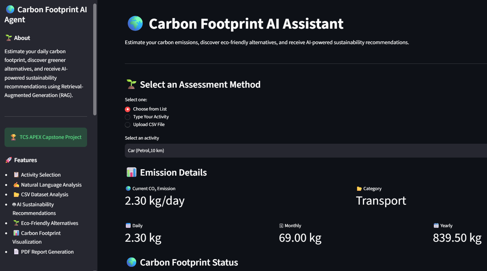
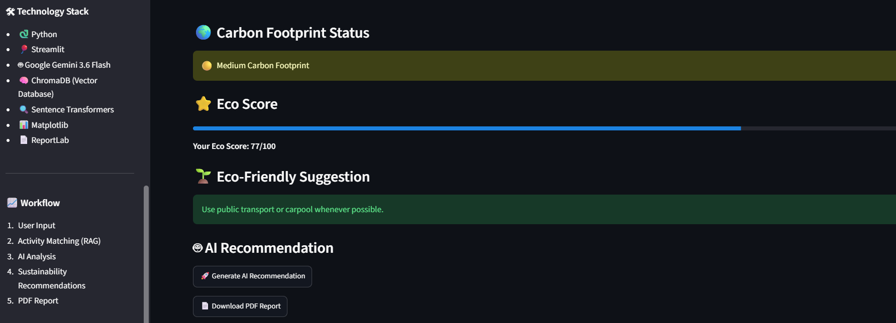
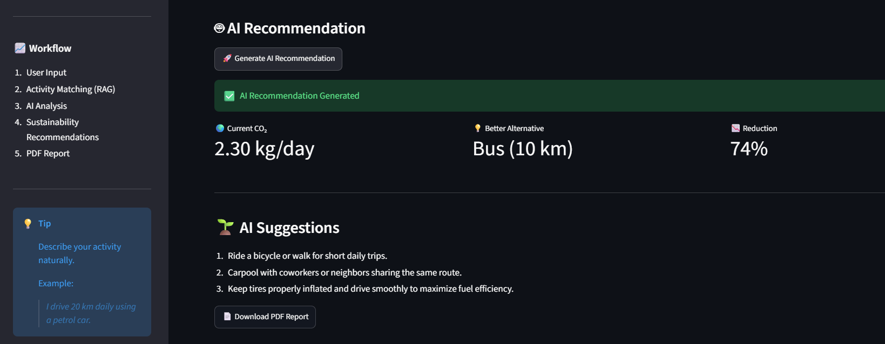
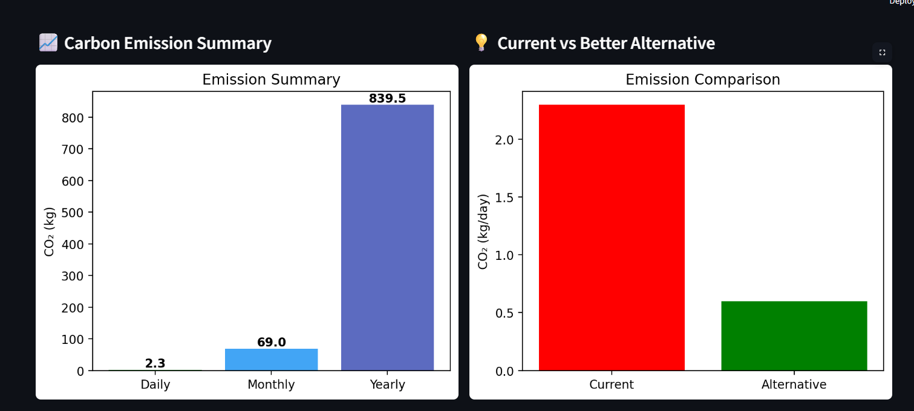
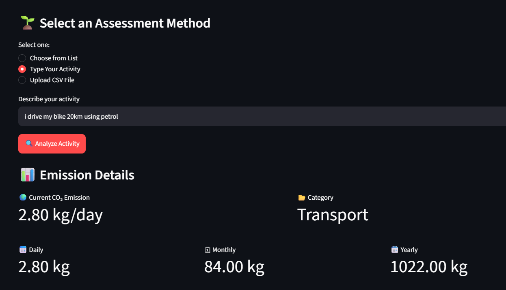
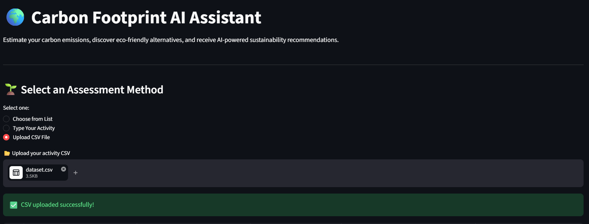
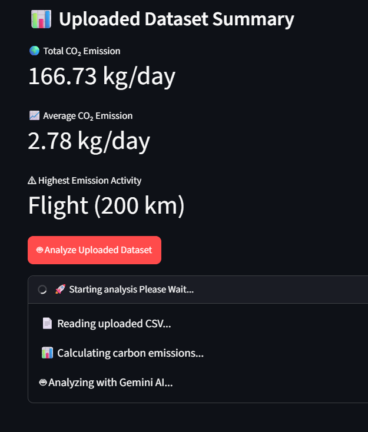
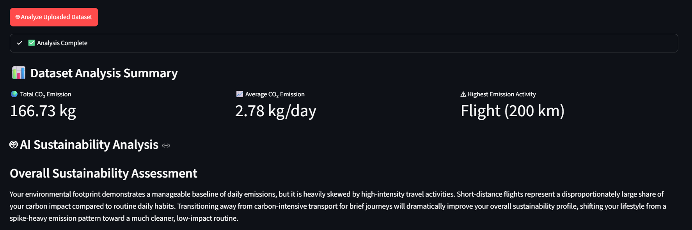
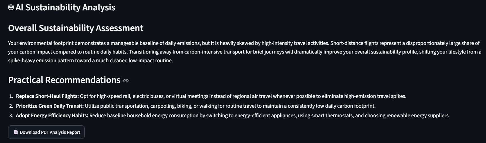

# 🌍 Carbon Footprint AI Agent



> AI-powered Sustainability Assistant for Carbon Footprint Estimation and Eco-friendly Recommendations using Retrieval-Augmented Generation (RAG) and Google Gemini AI.


---

# 🌐 Live Demo

🚀 **Try the application here:**

https://carbon-footprint-ai-agent.streamlit.app/

---

# 📌 Project Overview

Carbon Footprint AI Agent is an AI-powered sustainability assistant developed as part of the **TCS APEX Capstone Project**.

The application estimates carbon emissions from user activities and provides AI-generated eco-friendly recommendations using **Retrieval-Augmented Generation (RAG)**, **Sentence Transformers**, **ChromaDB**, and **Google Gemini AI**.

Users can:

- 🚗 Select an activity from the dataset
- ✍️ Describe an activity in natural language
- 📂 Upload a CSV file for carbon footprint analysis
- 🤖 Receive AI-generated sustainability recommendations
- 📊 Visualize emissions using interactive charts
- 📄 Download a PDF sustainability report

---

# ✨ Features

- ✅ Activity Selection from Dataset
- ✅ Natural Language Activity Analysis (RAG)
- ✅ CSV Upload & AI Dataset Analysis
- ✅ ChromaDB Semantic Search
- ✅ Google Gemini AI Recommendations
- ✅ Better Alternative Suggestions
- ✅ Carbon Emission Dashboard
- ✅ Daily / Monthly / Yearly Emission Calculation
- ✅ Interactive Charts & Visualizations
- ✅ Download Analysis Report (PDF)

---

# 🛠 Tech Stack

| Technology              | Purpose              |
| ----------------------- | -------------------- |
| Python                  | Backend              |
| Streamlit               | Web Interface        |
| Google Gemini 3.6 Flash | Large Language Model |
| ChromaDB                | Vector Database      |
| Sentence Transformers   | Embedding Generation |
| Pandas                  | Data Processing      |
| Matplotlib              | Data Visualization   |
| ReportLab               | PDF Generation       |

---

# 🧠 AI Workflow

```
                 User Input
                     │
                     ▼
        Sentence Transformer Embedding
                     │
                     ▼
          ChromaDB Vector Search
                     │
                     ▼
         Relevant Context Retrieved
                     │
                     ▼
          Google Gemini AI Analysis
                     │
                     ▼
      Eco-Friendly Recommendation
                     │
                     ▼
      Charts + PDF Sustainability Report
```

---

# 📂 Project Structure

```
CO2_AI_AGENT/
│
├── chroma_db/
├── screenshots/
├── .streamlit/
├── app.py
├── rag.py
├── embeddings.py
├── dataset.csv
├── tips.txt
├── requirements.txt
├── README.md
└── .gitignore
```

---

# 📊 Visualizations

The application generates:

- 📈 Carbon Emission Summary
- 🌱 Current vs Better Alternative Comparison
- 📊 Top CO₂ Emission Activities
- 🥧 Category-wise CO₂ Distribution
- 📋 Category Summary Table
- 📄 Downloadable PDF Sustainability Report

---

# 🚀 Installation

### Clone the repository

```bash
git clone https://github.com/adarsha545/CO2-AI-Agent.git
```

### Move into the project directory

```bash
cd CO2-AI-Agent
```

### Install dependencies

```bash
pip install -r requirements.txt
```

### Configure API Key

Create the following file:

```
.streamlit/secrets.toml
```

Add your Gemini API Key:

```toml
GEMINI_API_KEY="YOUR_GEMINI_API_KEY"
```

### Run the application

```bash
streamlit run app.py
```

---

# 📷 Application Screenshots

## 🏠 Home Page


---

## 🌱 Activity Selection & Carbon Footprint



---

## 🤖 AI Recommendation



---

## 📊 Carbon Footprint Dashboard & Charts



---

## ✍️ Natural Language Activity Analysis (RAG)



---

## 📂 CSV Upload



---

## 📈 Dataset Analysis Summary



---

## 🌍 AI Sustainability Assessment



---

## 💡 Practical Recommendations



---

# 📈 Future Enhancements

- 🔐 User Authentication
- 🌍 Real-time Carbon Emission API Integration
- 🎙 Voice-based Activity Input
- 📱 Mobile Application
- ☁️ Cloud Database Integration
- 📈 Personal Carbon Footprint Tracking Dashboard
- 🌐 Multi-language Support

---

# 👨‍💻 Developer

**Adarsha Ghosh**

M.Tech in Computer Science & Engineering

**TCS APEX Capstone Project 2026**

**GitHub Profile**  
https://github.com/adarsha545

**Project Repository**  
https://github.com/adarsha545/CO2-AI-Agent

**Live Application**  
https://carbon-footprint-ai-agent.streamlit.app/

---

# 📜 License

This project is developed for **educational and research purposes** under the **TCS APEX Capstone Program**.

---

⭐ **If you found this project useful, consider giving it a Star on GitHub!**
